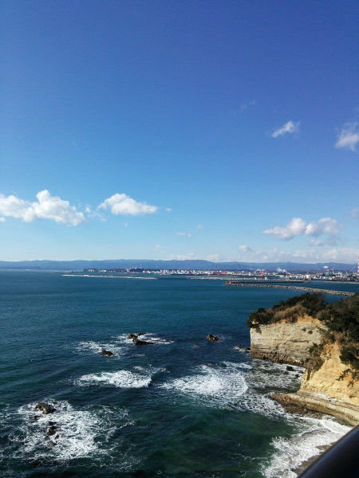
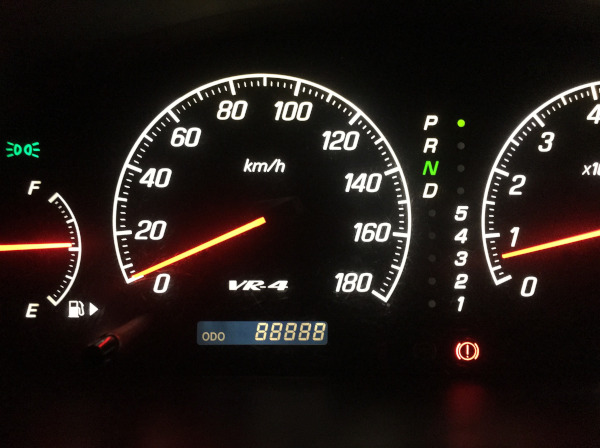

# PHP-PhotoGps

`PHP-PhotoGps` is a simple library to get GPS data from a photo.

This library reads EXIF data of a jpeg file,

and can convert latitude/longitude into sexagesimal(English/Japanese) or decimal formats.

## Contents

- [Requirements](#requirements)
- [Installation](#installation)
- [Usage](#usage)
  - [Basic Usage](#basic-usage)
  - [List of Images](#list-of-images)
  - [Format Configuration](#format-configuration)
- [Examples](#examples)
- [LICENSE](#license)

## Requirements

- PHP 8.0.0 or later
- GD library
- Composer

## Installation

```bash
composer require macocci7/php-photo-gps
```

## Usage

### Basic Usage

- PHP

    ```php
    <?php

    require('../vendor/autoload.php');

    use Macocci7\PhpPhotoGps\PhotoGps;

    $filename = 'img/with_gps.jpg';    // includes GPS tags
    $pg = new PhotoGps($filename);

    echo "[" . $filename . "]--------------------\n";

    // Latitude in sexagesimal format
    echo "Latitude: " . $pg->latitudeS() . "\n";
    echo "緯度: " . $pg->lang('ja')->latitudeS() . "\n";

    // Longitude in sexagesimal format
    echo "Longitude: " . $pg->lang('eng')->longitudeS() . "\n";
    echo "経度: " . $pg->lang('ja')->longitudeS() . "\n";

    // Altitude
    echo "Altitude: " . $pg->altitude() . "\n";

    // Coord in decimal format ('S' and 'W' results in negative value.)
    echo "Coord: " . $pg->latitudeD() . ", " . $pg->longitudeD() . "\n";
    ```

- OUTPUT

    ```
    [img/with_gps.jpg]--------------------
    Latitude: 37°3'26.2"N
    緯度: 北緯37度3分26.2秒
    Longitude: 140°53'32.8"E
    経度: 東経140度53分32.8秒
    Altitude: 13
    Coord: 37.057274166667, 140.89244166667
    ```

### List of Images

- PHP:

    ```php
    <?php

    require_once('../vendor/autoload.php');

    use Macocci7\PhpPhotoGps\PhotoGps;

    $pg = new PhotoGps();

    $images = glob('img/*.{jp*g,JP*G}', GLOB_BRACE);
    sort($images);

    echo "# Photo GPS: List\n\n";
    echo "<table>\n";
    echo "<tr><th>Image</th><th>GPS</th><th>Coordinate</th></tr>\n";
    foreach ($images as $file) {
        $link = sprintf("<a href='%s'></a>", $file, $file);
        $pg->load($file);
        $hasGps = $pg->hasGps();
        echo sprintf("<td>%s</td>", $link);
        echo sprintf("<td>%s</td>", $hasGps ? 'o' : 'x');
        echo "<td>\n";
        if ($hasGps) {
            echo sprintf(
                "<a href='%s'>%s, %s</a><br />\n",
                sprintf(
                    "https://www.google.com/maps/place/%s+%s/@%.7f,%.7f,17z/?authuser=0&entry=ttu",
                    urlencode($pg->lang('eng')->latitudeS()),
                    urlencode($pg->lang('eng')->longitudeS()),
                    $pg->latitudeD(),
                    $pg->longitudeD()
                ),
                sprintf("%.14f", $pg->latitudeD()),
                sprintf("%.14f", $pg->longitudeD())
            );
            foreach ($pg->langs() as $lang) {
                echo sprintf(
                    "%s, %s<br />\n",
                    $hasGps ? $pg->lang($lang)->longitudeS() : '---',
                    $hasGps ? $pg->lang($lang)->latitudeS() : '---'
                );
            }
        } else {
            echo "---\n";
        }
        echo "</td></tr>\n";
    }
    echo "</table>\n";
    ```

- Result:

    # Photo GPS: List

    <table>
    <tr><th>Image</th><th>GPS</th><th>Coordinate</th></tr>
    <td><a href='example/img/iino_hachiman_shirine.jpg'></a></td><td>o</td><td>
    <a href='https://www.google.com/maps/place/37%C2%B03%2734.6%22N+140%C2%B052%2756.4%22E/@37.0596047,140.8823289,17z/?authuser=0&entry=ttu'>37.05960472222222, 140.88232888888891</a><br />
    37°3'34.6"N, 140°52'56.4"E<br />
    北緯37度3分34.6秒, 東経140度52分56.4秒<br />
    </td></tr>
    <td><a href='example/img/miracle_north_intersection.jpg'></a></td><td>o</td><td>
    <a href='https://www.google.com/maps/place/35%C2%B052%2720.5%22N+139%C2%B047%270.8%22E/@35.8723586,139.7835639,17z/?authuser=0&entry=ttu'>35.87235861111111, 139.78356388888889</a><br />
    35°52'20.5"N, 139°47'0.8"E<br />
    北緯35度52分20.5秒, 東経139度47分0.8秒<br />
    </td></tr>
    <td><a href='example/img/misaki_park.jpg'></a></td><td>o</td><td>
    <a href='https://www.google.com/maps/place/36%C2%B056%273.8%22N+140%C2%B055%2713.6%22E/@36.9343917,140.9204425,17z/?authuser=0&entry=ttu'>36.93439166666666, 140.92044249999998</a><br />
    36°56'3.8"N, 140°55'13.6"E<br />
    北緯36度56分3.8秒, 東経140度55分13.6秒<br />
    </td></tr>
    <td><a href='example/img/odd88888.JPG'></a></td><td>o</td><td>
    <a href='https://www.google.com/maps/place/37%C2%B01%2758.6%22N+140%C2%B054%274.4%22E/@37.0329453,140.9012353,17z/?authuser=0&entry=ttu'>37.03294527777778, 140.90123527777777</a><br />
    37°1'58.6"N, 140°54'4.4"E<br />
    北緯37度1分58.6秒, 東経140度54分4.4秒<br />
    </td></tr>
    <td><a href='example/img/sendai_snowman01.JPEG'></a></td><td>o</td><td>
    <a href='https://www.google.com/maps/place/38%C2%B015%2749.9%22N+140%C2%B052%2715.1%22E/@38.2638617,140.8708508,17z/?authuser=0&entry=ttu'>38.26386166666666, 140.87085083333335</a><br />
    38°15'49.9"N, 140°52'15.1"E<br />
    北緯38度15分49.9秒, 東経140度52分15.1秒<br />
    </td></tr>
    <td><a href='example/img/with_gps.jpg'></a></td><td>o</td><td>
    <a href='https://www.google.com/maps/place/37%C2%B03%2726.2%22N+140%C2%B053%2732.8%22E/@37.0572742,140.8924417,17z/?authuser=0&entry=ttu'>37.05727416666667, 140.89244166666666</a><br />
    37°3'26.2"N, 140°53'32.8"E<br />
    北緯37度3分26.2秒, 東経140度53分32.8秒<br />
    </td></tr>
    <td><a href='example/img/without_gps.jpg'></a></td><td>x</td><td>
    ---
    </td></tr>
    </table>

### Format Configuration

- PHP:

    ```php
    <?php

    require_once('../vendor/autoload.php');

    use Macocci7\PhpPhotoGps\PhotoGps;

    $filename = 'img/with_gps.jpg';    // includes GPS tags
    $pg = new PhotoGps($filename);

    echo "[" . $filename . "]--------------------\n";

    // Format: default
    echo "Current format [eng]: " . $pg->lang('eng')->format() . "\n";
    echo "Current format [ja]: " . $pg->lang('ja')->format() . "\n\n";

    // Latitude in sexagesimal format
    echo "Latitude: " . $pg->latitudeS() . "\n";
    echo "緯度: " . $pg->lang('ja')->latitudeS() . "\n";

    // Longitude in sexagesimal format
    echo "Longitude: " . $pg->lang('eng')->longitudeS() . "\n";
    echo "経度: " . $pg->lang('ja')->longitudeS() . "\n\n";

    echo "[Chang format:eng]---------------------------------\n";

    // Configure format
    $pg->lang('eng')->format('{ref:u}: {seconds:v}{seconds:u}, {minutes:v}{minutes:u}, {degrees:v}{degrees:u}');

    // Current format
    echo "Current format [eng]: " . $pg->lang('eng')->format() . "\n";
    echo "Current format [ja]: " . $pg->lang('ja')->format() . "\n\n";

    // Latitude in sexagesimal format
    echo "Latitude: " . $pg->latitudeS() . "\n";
    echo "緯度: " . $pg->lang('ja')->latitudeS() . "\n";

    // Longitude in sexagesimal format
    echo "Longitude: " . $pg->lang('eng')->longitudeS() . "\n";
    echo "経度: " . $pg->lang('ja')->longitudeS() . "\n\n";

    echo "[Change format:ja]---------------------------------\n";

    // Configure format
    $pg->lang('ja')->format('{seconds:v}{seconds:u}, {minutes:v}{minutes:u}, {degrees:v}{degrees:u} ({ref:u})');

    // Current format
    echo "Current format [eng]: " . $pg->lang('eng')->format() . "\n";
    echo "Current format [ja]: " . $pg->lang('ja')->format() . "\n\n";

    // Latitude in sexagesimal format
    echo "Latitude: " . $pg->latitudeS() . "\n";
    echo "緯度: " . $pg->lang('ja')->latitudeS() . "\n";

    // Longitude in sexagesimal format
    echo "Longitude: " . $pg->lang('eng')->longitudeS() . "\n";
    echo "経度: " . $pg->lang('ja')->longitudeS() . "\n\n";

    echo "[Reset format:ja]---------------------------------\n";

    // Reset format
    $pg->lang('ja')->resetFormat();

    // Current format
    echo "Current format [eng]: " . $pg->lang('eng')->format() . "\n";
    echo "Current format [ja]: " . $pg->lang('ja')->format() . "\n\n";

    // Latitude in sexagesimal format
    echo "Latitude: " . $pg->latitudeS() . "\n";
    echo "緯度: " . $pg->lang('ja')->latitudeS() . "\n";

    // Longitude in sexagesimal format
    echo "Longitude: " . $pg->lang('eng')->longitudeS() . "\n";
    echo "経度: " . $pg->lang('ja')->longitudeS() . "\n\n";
    ```

- Result:

    ```
    [img/with_gps.jpg]--------------------
    Current format [eng]: {degrees:v}{degrees:u}{minutes:v}{minutes:u}{seconds:v}{seconds:u}{ref:u}
    Current format [ja]: {ref:u}{degrees:v}{degrees:u}{minutes:v}{minutes:u}{seconds:v}{seconds:u}

    Latitude: 北緯37度3分26.2秒
    緯度: 北緯37度3分26.2秒
    Longitude: 140°53'32.8"E
    経度: 東経140度53分32.8秒

    [Chang format:eng]---------------------------------
    Current format [eng]: {ref:u}: {seconds:v}{seconds:u}, {minutes:v}{minutes:u}, {degrees:v}{degrees:u}
    Current format [ja]: {ref:u}{degrees:v}{degrees:u}{minutes:v}{minutes:u}{seconds:v}{seconds:u}

    Latitude: 北緯37度3分26.2秒
    緯度: 北緯37度3分26.2秒
    Longitude: E: 32.8", 53', 140°
    経度: 東経140度53分32.8秒

    [Change format:ja]---------------------------------
    Current format [eng]: {ref:u}: {seconds:v}{seconds:u}, {minutes:v}{minutes:u}, {degrees:v}{degrees:u}
    Current format [ja]: {seconds:v}{seconds:u}, {minutes:v}{minutes:u}, {degrees:v}{degrees:u} ({ref:u})

    Latitude: 26.2秒, 3分, 37度 (北緯)
    緯度: 26.2秒, 3分, 37度 (北緯)
    Longitude: E: 32.8", 53', 140°
    経度: 32.8秒, 53分, 140度 (東経)

    [Reset format:ja]---------------------------------
    Current format [eng]: {ref:u}: {seconds:v}{seconds:u}, {minutes:v}{minutes:u}, {degrees:v}{degrees:u}
    Current format [ja]: {ref:u}{degrees:v}{degrees:u}{minutes:v}{minutes:u}{seconds:v}{seconds:u}

    Latitude: 北緯37度3分26.2秒
    緯度: 北緯37度3分26.2秒
    Longitude: E: 32.8", 53', 140°
    経度: 東経140度53分32.8秒

    ```

## Examples

- [BasicUsage.php](example/BasicUsage.php) >> results in [BasicUsage.txt](example/BasicUsage.txt)
- [GPStags.php](example/GPStags.php) >> results in [GPStags.txt](example/GPStags.txt)
- [List.php](example/List.md) >> results in [List.md](example/List.md)
- [ConfigFormat.php](example/ConfigFormat.php) >> results in [ConfigFormat.txt](example/ConfigFormat.txt)

## LICENSE

[MIT](LICENSE)

***

## Changelog

*2024/01/02: version updated 1.3.0 => 1.3.1*
*--- resetting format enabled, documents updated*

*2024/01/01: version updated 1.2.0 => 1.3.0*
*--- format configuration enabled*

*2023/11/11: version updated 1.1.1 => 1.2.0*
*--- usages of some methods have been changed*

***

*Document created: 2023/09/30*

*Document updated: 2024/01/02*

Copyright 2023 - 2024 macocci7
