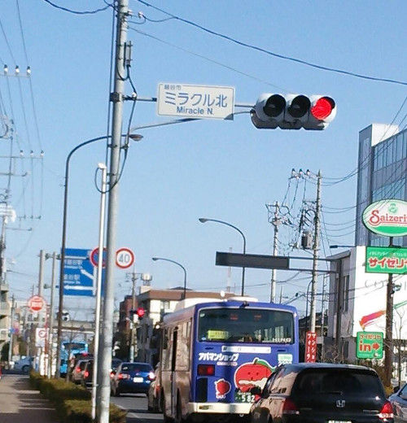
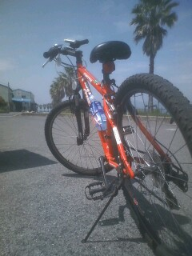

# PHP-PhotoGps

## 1. Features

`PHP-PhotoGps` is a simple library to get GPS data from a photo.

This library reads EXIF data of a jpeg file,

and can convert latitude/longitude into sexagesimal(English/Japanese) or decimal formats,

converts directions into degree with arrow images
,

converts speeds, date stamps and time stamps into human-readable strings.

Remote files (via http: or https:) are supported.

Currently Exif Version 3.0 is supported. (Wait for other versions...)

## 2. Contents

- [1. Features](#1-features)
- 2\. Contents
- [3. Requirements](#3-requirements)
- [4. Installation](#4-installation)
- [5. Usage](#5-usage)
  - [5.1. Usage: Basic](#51-usage-basic)
  - [5.2. Usage: Format Configuration](#52-usage-format-configuration)
  - [5.3. Usage: Photo List with Checking Geo Data](#53-usage-photo-list-with-checking-geo-data)
  - [5.4. Usage: Read All GPS Tags](#54-usage-read-all-gps-tags)
  - [5.5. Usage: GPS Attribute Information](#55-usage-gps-attribute-information)
- [6. Examples](#6-examples)
- [7. LICENSE](#7-license)
- [8. Changelog](#8-changelog)

## 3. Requirements

- PHP 8.0.30 or later
- GD library enabled

  check with commands:

  ```bash
  php -m | grep gd
  php -i | grep gd
  ```

- Composer

## 4. Installation

```bash
composer require macocci7/php-photo-gps
```

## 5. Usage

### 5.1. Usage: Basic

- [5.1.1. PHP](#511-php)
- [5.1.2. Output](#512-output)
- [5.1.3. Details](#513-details)

#### 5.1.1. PHP

- [BasicUsage.php](example/BasicUsage.php)

    ```php
    <?php

    require('../vendor/autoload.php');

    use Macocci7\PhpPhotoGps\PhotoGps;

    $filename = 'img/with_gps.jpg';    // includes GPS tags
    $pg = new PhotoGps($filename);

    echo "[" . $filename . "]--------------------\n";

    // Latitude in sexagesimal format
    echo "Latitude: " . $pg->latitudeS() . "\n";
    echo "緯度: " . $pg->lang('ja')->latitudeS() . "\n";

    // Longitude in sexagesimal format
    echo "Longitude: " . $pg->lang('eng')->longitudeS() . "\n";
    echo "経度: " . $pg->lang('ja')->longitudeS() . "\n";

    // Altitude as strings
    echo "Altitude: " . $pg->lang('eng')->altitudeS() . "\n";
    echo "高度: " . $pg->lang('ja')->altitudeS() . "\n";

    // Coord in decimal format ('S' and 'W' results in negative value.)
    echo "Coord: " . $pg->latitudeD() . ", " . $pg->longitudeD() . "\n";
    ```

#### 5.1.2. Output

- [BasicUsage.txt](example/BasicUsage.txt)

    ```
    [img/with_gps.jpg]--------------------
    Latitude: 37°3'26.2"N
    緯度: 北緯37度3分26.2秒
    Longitude: 140°53'32.8"E
    経度: 東経140度53分32.8秒
    Altitude: (Above Ellipsoidal Surface) 13.00 m
    高度: （正値楕円体高） 13.00 メートル
    Coord: 37.057274166667, 140.89244166667
    ```

#### 5.1.3. Details

- Import autoloader: `require_once('../vendor/autoload.php')`
- `use` declaration: `use Macocci7\PhpPhotoGps\PhotoGps;`
- Instantiation: `new PhotoGps()` or `new PhotoGps($path)`
    - **Note**: If HTTP or HTTPS url is specified as `$path`, `download` directory will be created in current directory, and the image will be downloaded in it.
- Language: `eng` as default.
    - Get Current: `lang()`
    - Set as English: `lang('eng')`
    - Set as Japanese: `lang('ja')`

    Language Names are defined in `config/PhotoGps.neon`.

- Latitude:
    - Decimal: `latitudeD()`
    - Sexagesimal: `latitudeS()`
- Longitude:
    - Decimal: `longitudeD()`
    - Sexagesimal: `longitudeS()`
- Altitude:
    - Decimal: `altitude()`
    - Strings with prefix & unit: `altitudeS()`
    
### 5.2. Usage: Format Configuration

only for `latitudeS()` and `longitudeS()`.

- [5.2.1. PHP](#521-php)
- [5.2.2. Output](#522-output)
- [5.2.3. Details](#523-details)

#### 5.2.1. PHP

- [ConfigFormat.php](example/ConfigFormat.php)

    ```php
    <?php

    require_once('../vendor/autoload.php');

    use Macocci7\PhpPhotoGps\PhotoGps;

    $filename = 'img/with_gps.jpg';    // includes GPS tags
    $pg = new PhotoGps($filename);

    echo "[" . $filename . "]--------------------\n";

    // Format: default
    echo "Current format [eng]: " . $pg->lang('eng')->format() . "\n";
    echo "Current format [ja]: " . $pg->lang('ja')->format() . "\n\n";

    // Latitude in sexagesimal format
    echo "Latitude: " . $pg->lang('eng')->latitudeS() . "\n";
    echo "緯度: " . $pg->lang('ja')->latitudeS() . "\n";

    // Longitude in sexagesimal format
    echo "Longitude: " . $pg->lang('eng')->longitudeS() . "\n";
    echo "経度: " . $pg->lang('ja')->longitudeS() . "\n\n";

    echo "[Chang format:eng]---------------------------------\n";

    // Configure format
    $pg->lang('eng')->format('{ref:u}: {seconds:v}{seconds:u}, {minutes:v}{minutes:u}, {degrees:v}{degrees:u}');

    // Current format
    echo "Current format [eng]: " . $pg->lang('eng')->format() . "\n";
    echo "Current format [ja]: " . $pg->lang('ja')->format() . "\n\n";

    // Latitude in sexagesimal format
    echo "Latitude: " . $pg->lang('eng')->latitudeS() . "\n";
    echo "緯度: " . $pg->lang('ja')->latitudeS() . "\n";

    // Longitude in sexagesimal format
    echo "Longitude: " . $pg->lang('eng')->longitudeS() . "\n";
    echo "経度: " . $pg->lang('ja')->longitudeS() . "\n\n";

    echo "[Change format:ja]---------------------------------\n";

    // Configure format
    $pg->lang('ja')->format('{seconds:v}{seconds:u}, {minutes:v}{minutes:u}, {degrees:v}{degrees:u} ({ref:u})');

    // Current format
    echo "Current format [eng]: " . $pg->lang('eng')->format() . "\n";
    echo "Current format [ja]: " . $pg->lang('ja')->format() . "\n\n";

    // Latitude in sexagesimal format
    echo "Latitude: " . $pg->lang('eng')->latitudeS() . "\n";
    echo "緯度: " . $pg->lang('ja')->latitudeS() . "\n";

    // Longitude in sexagesimal format
    echo "Longitude: " . $pg->lang('eng')->longitudeS() . "\n";
    echo "経度: " . $pg->lang('ja')->longitudeS() . "\n\n";

    echo "[Reset format:ja]---------------------------------\n";

    // Reset format
    $pg->lang('ja')->resetFormat();

    // Current format
    echo "Current format [eng]: " . $pg->lang('eng')->format() . "\n";
    echo "Current format [ja]: " . $pg->lang('ja')->format() . "\n\n";

    // Latitude in sexagesimal format
    echo "Latitude: " . $pg->lang('eng')->latitudeS() . "\n";
    echo "緯度: " . $pg->lang('ja')->latitudeS() . "\n";

    // Longitude in sexagesimal format
    echo "Longitude: " . $pg->lang('eng')->longitudeS() . "\n";
    echo "経度: " . $pg->lang('ja')->longitudeS() . "\n\n";
    ```

#### 5.2.2. Output

- [ConfigFormat.txt](example/ConfigFormat.txt)

    ```
    [img/with_gps.jpg]--------------------
    Current format [eng]: {degrees:v}{degrees:u}{minutes:v}{minutes:u}{seconds:v}{seconds:u}{ref:u}
    Current format [ja]: {ref:u}{degrees:v}{degrees:u}{minutes:v}{minutes:u}{seconds:v}{seconds:u}

    Latitude: 37°3'26.2"N
    緯度: 北緯37度3分26.2秒
    Longitude: 140°53'32.8"E
    経度: 東経140度53分32.8秒

    [Chang format:eng]---------------------------------
    Current format [eng]: {ref:u}: {seconds:v}{seconds:u}, {minutes:v}{minutes:u}, {degrees:v}{degrees:u}
    Current format [ja]: {ref:u}{degrees:v}{degrees:u}{minutes:v}{minutes:u}{seconds:v}{seconds:u}

    Latitude: N: 26.2", 3', 37°
    緯度: 北緯37度3分26.2秒
    Longitude: E: 32.8", 53', 140°
    経度: 東経140度53分32.8秒

    [Change format:ja]---------------------------------
    Current format [eng]: {ref:u}: {seconds:v}{seconds:u}, {minutes:v}{minutes:u}, {degrees:v}{degrees:u}
    Current format [ja]: {seconds:v}{seconds:u}, {minutes:v}{minutes:u}, {degrees:v}{degrees:u} ({ref:u})

    Latitude: N: 26.2", 3', 37°
    緯度: 26.2秒, 3分, 37度 (北緯)
    Longitude: E: 32.8", 53', 140°
    経度: 32.8秒, 53分, 140度 (東経)

    [Reset format:ja]---------------------------------
    Current format [eng]: {ref:u}: {seconds:v}{seconds:u}, {minutes:v}{minutes:u}, {degrees:v}{degrees:u}
    Current format [ja]: {ref:u}{degrees:v}{degrees:u}{minutes:v}{minutes:u}{seconds:v}{seconds:u}

    Latitude: N: 26.2", 3', 37°
    緯度: 北緯37度3分26.2秒
    Longitude: E: 32.8", 53', 140°
    経度: 東経140度53分32.8秒
    ```

#### 5.2.3. Details

Default format is defined in `conf/PhotoGps.neon` in each language.
- Get Current: `format()`
- Set Format: `format($format)`
- Format-Tags:

    |Item|Tag|`eng`|`ja`|
    |:---|:---|---|---|
    |Ref|{ref:u}|N|北緯|
    |Degrees Value|{degrees:v}|12|12|
    |Degrees Unit|{degrees:u}|°|度|
    |Minutes Value|{minutes:v}|34|34|
    |Minutes Unit|{minutes:u}|'|分|
    |Seconds Value|{seconds:v}|56|56|
    |Seconds Unit|{seconds:u}|"|秒|

### 5.3. Usage: Photo List with Checking Geo Data

Geo Data means latitude and longitude here.

The code below creates a list of photos in the dir `img/`.

- [5.3.1. PHP](#531-php)
- [5.3.2. Result](#532-result)
- [5.3.3. Details](#533-details)

#### 5.3.1. PHP

- [CheckGeoData.php](example/CheckGeoData.php)

    ```php
    <?php

    require_once('../vendor/autoload.php');

    use Macocci7\PhpPhotoGps\PhotoGps;

    $pg = new PhotoGps();

    $images = glob('img/*.{jp*g,JP*G}', GLOB_BRACE);
    sort($images);

    echo "# Photo List: Geo Data\n\n";
    echo "<table>\n";
    echo "<tr><th>Image</th><th>Geo</th><th>Coordinate</th></tr>\n";
    foreach ($images as $file) {
        $link = sprintf("<a href='%s'></a>", $file, $file);
        $pg->load($file);
        $hasGps = $pg->hasGps();
        $hasGeo = $pg->hasGeo();
        $hasAltitude = $pg->hasAltitude();
        echo sprintf("<td>%s</td>", $link);
        echo sprintf("<td>%s</td>", $hasGps ? 'o' : 'x');
        echo "<td>\n";
        if ($hasGeo) {
            echo sprintf(
                "<a href='%s'>%s, %s</a><br />\n",
                sprintf(
                    "https://www.google.com/maps/place/%s+%s/@%.7f,%.7f,17z/?authuser=0&entry=ttu",
                    urlencode($pg->lang('eng')->latitudeS()),
                    urlencode($pg->lang('eng')->longitudeS()),
                    $pg->latitudeD(),
                    $pg->longitudeD()
                ),
                sprintf("%.14f", $pg->latitudeD()),
                sprintf("%.14f", $pg->longitudeD())
            );
            foreach ($pg->langs() as $lang) {
                echo sprintf(
                    "%s, %s<br />\n",
                    $pg->lang($lang)->latitudeS(),
                    $pg->lang($lang)->longitudeS()
                );
            }
        } else {
            echo "No Geo Data\n\n";
        }
        if ($hasAltitude) {
            foreach ($pg->langs() as $lang) {
                echo sprintf("%s\n\n", $pg->lang($lang)->altitudeS());
            }
        } else {
            echo "No Altitude Data\n\n";
        }
        echo "</td></tr>\n";
    }
    echo "</table>\n";
    ```

#### 5.3.2. Result

- [CheckGeoData.md](example/CheckGeoData.md)

    # Photo List: Geo Data

    <table>
    <tr><th>Image</th><th>Geo</th><th>Coordinate</th></tr>
    <td><a href='example/img/fake_gps_003.jpg'></a></td><td>o</td><td>
    <a href='https://www.google.com/maps/place/31%C2%B031%2759.7%22N+35%C2%B028%2745.3%22E/@31.5332455,35.4792375,17z/?authuser=0&entry=ttu'>31.53324552730697, 35.47923749904281</a><br />
    31°31'59.7"N, 35°28'45.3"E<br />
    北緯31度31分59.7秒, 東経35度28分45.3秒<br />
    (Below Sea Level) 422.00 m

    （負値海抜） 422.00 メートル

    </td></tr>
    <td><a href='example/img/fake_gps_004.jpg'></a></td><td>o</td><td>
    <a href='https://www.google.com/maps/place/20%C2%B011%2720.9%22S+67%C2%B035%2715.8%22W/@-20.1891385,-67.5877247,17z/?authuser=0&entry=ttu'>-20.18913849132269, -67.58772465286874</a><br />
    20°11'20.9"S, 67°35'15.8"W<br />
    南緯20度11分20.9秒, 西経67度35分15.8秒<br />
    (Above Sea Level) 3700.00 m

    （正値海抜） 3700.00 メートル

    </td></tr>
    <td><a href='example/img/miracle_north_intersection.jpg'></a></td><td>o</td><td>
    <a href='https://www.google.com/maps/place/35%C2%B052%2720.5%22N+139%C2%B047%270.8%22E/@35.8723586,139.7835639,17z/?authuser=0&entry=ttu'>35.87235861111111, 139.78356388888889</a><br />
    35°52'20.5"N, 139°47'0.8"E<br />
    北緯35度52分20.5秒, 東経139度47分0.8秒<br />
    (Above Ellipsoidal Surface) 3.70 m

    （正値楕円体高） 3.70 メートル

    </td></tr>
    <td><a href='example/img/sendai_snowman01.JPEG'></a></td><td>o</td><td>
    <a href='https://www.google.com/maps/place/38%C2%B015%2749.9%22N+140%C2%B052%2715.1%22E/@38.2638617,140.8708508,17z/?authuser=0&entry=ttu'>38.26386166666666, 140.87085083333335</a><br />
    38°15'49.9"N, 140°52'15.1"E<br />
    北緯38度15分49.9秒, 東経140度52分15.1秒<br />
    (Above Ellipsoidal Surface) 42.00 m

    （正値楕円体高） 42.00 メートル

    </td></tr>
    <td><a href='example/img/with_gps.jpg'></a></td><td>o</td><td>
    <a href='https://www.google.com/maps/place/37%C2%B03%2726.2%22N+140%C2%B053%2732.8%22E/@37.0572742,140.8924417,17z/?authuser=0&entry=ttu'>37.05727416666667, 140.89244166666666</a><br />
    37°3'26.2"N, 140°53'32.8"E<br />
    北緯37度3分26.2秒, 東経140度53分32.8秒<br />
    (Above Ellipsoidal Surface) 13.00 m

    （正値楕円体高） 13.00 メートル

    </td></tr>
    <td><a href='example/img/without_gps.jpg'></a></td><td>x</td><td>
    No Geo Data

    No Altitude Data

    </td></tr>
    </table>

#### 5.3.3. Details

- Load GPS Data from a photo: `load($path)`
- Check If GPS Data Exists: `hasGps()`
- Check If Geo Data Exists: `hasGeo()`
- Check If Altitude Exists: `hasAltitude()`

### 5.4. Usage: Read All GPS Tags

`gps()` method returns all Exif tags which has `GPS` prefix.

- [5.4.1. PHP](#541-php)
- [5.4.2. Result](#542-result)
- [5.4.3. Details](#543-details)

#### 5.4.1. PHP

- [ReadAllGpsTags.md](example/ReadAllGpsTags.md)

    ```php
    <?php

    require('../vendor/autoload.php');

    use Macocci7\PhpPhotoGps\PhotoGps;
    use Macocci7\PhpPhotoGps\Helper\Dir;
    use Macocci7\PhpPhotoGps\Helper\Arrow;

    $pg = new PhotoGps();
    $images = [
        'File with Fake GPS via HTTP' => 'http://macocci7.net/photo/gps/remote_fake_gps_001.jpg',
        'File with Fake GPS via HTTPS' => 'https://macocci7.net/photo/gps/remote_fake_gps_002.jpg',
        'Local File with GPS' => 'img/with_gps.jpg',
        'No GPS tags' => 'img/without_gps.jpg',
    ];
    $arrowSize = 30;

    Dir::clear('./download/');
    echo "# Exif: GPS Tags\n\n";

    // Loop for images
    foreach ($images as $title => $image) {
        echo "## $title\n\n";
        echo "<table>\n";
        $style = 'display: flex; align-items: top;';
        echo sprintf("<tr style='%s'>\n<td>\n", $style);

        // Thumbnail
        echo "\n\n";

        // Load GPS Data
        $pg->load($image);

        // Show Attributes Converted from GPS Data
        $style = 'display: flex; justify-content: right; align-items: center;';
        $direction = $pg->direction();
        $speedS = $pg->speedS();
        $track = $pg->track();
        $destBearing = $pg->destBearing();
        $datestamp = $pg->datestamp();
        $timestamp = $pg->timestamp();
        $judge = $direction . $speedS . $track . $destBearing . $datestamp . $timestamp;
        if (strlen($judge) > 0) {
            echo "|Attribute|Value|\n";
            echo "|:---|---:|\n";
        }

        // Image Direction
        if (!is_null($direction)) {
            $pathArrow = sprintf('img/arrow%.2f.png', $direction);
            Arrow::make($direction)->save($pathArrow);
            echo sprintf(
                "|Image Direction|<div style='%s'>%s</div>|\n",
                $style,
                $pathArrow,
                $arrowSize,
                $arrowSize,
                $pg->directionS()
            );
        }

        // Speed
        if (!is_null($speedS)) {
            echo sprintf("|Speed|%s|\n", $speedS);
        }

        // Track
        if (!is_null($track)) {
            $pathArrow = sprintf('img/arrow%.2f.png', $track);
            Arrow::make($track)->save($pathArrow);
            echo sprintf(
                "|Track|<div style='%s'>%s</div>|\n",
                $style,
                $pathArrow,
                $arrowSize,
                $arrowSize,
                $pg->trackS()
            );
        }

        // Dest Bearing
        if (!is_null($destBearing)) {
            $pathArrow = sprintf('img/arrow%.2f.png', $destBearing);
            Arrow::make($destBearing)->save($pathArrow);
            echo sprintf(
                "|Destination Bearing|<div style='%s'>%s</div>|\n",
                $style,
                $pathArrow,
                $arrowSize,
                $arrowSize,
                $pg->destBearingS()
            );
        }

        // Date Stamp
        echo $datestamp ? sprintf("|Datestamp|%s (UTC)|\n", $datestamp) : '';

        // Time Stamp
        echo $timestamp ? sprintf("|Timestamp|%s (UTC)|\n", $timestamp) : '';

        echo "</td>\n<td>\n\n";

        // Check If GPS Data Exists
        if (!$pg->hasGps()) {
            echo "No GPS data.\n\n";
            continue;
        }

        // Show GPS Data
        echo "|Tag|Value|\n";
        echo "|:---|---:|\n";
        foreach ($pg->gps() as $tag => $value) {
            echo sprintf(
                "|%s|%s|\n",
                $tag,
                is_array($value) ? implode('<br />', $value) : $value
            );
        }

        echo "</td>\n</tr>\n</table>\n\n";
    }
    ```

#### 5.4.2. Result

- [ReadAllGpsTags.md](example/ReadAllGpsTags.md)

    # Exif: GPS Tags

    ## File with Fake GPS via HTTP

    <table>
    <tr style='display: flex; align-items: top;'>
    <td>
    

    |Attribute|Value|
    |:---|---:|
    |Image Direction|<div style='display: flex; justify-content: right; align-items: center;'>M 352.40°</div>|
    |Speed|12.45kt|
    |Track|<div style='display: flex; justify-content: right; align-items: center;'>M 62.90°</div>|
    |Destination Bearing|<div style='display: flex; justify-content: right; align-items: center;'>M 138.69°</div>|
    |Datestamp|2018/03/31 (UTC)|
    |Timestamp|02:22:14 (UTC)|
    </td>
    <td>

    |Tag|Value|
    |:---|---:|
    |GPS_IFD_Pointer|366|
    |GPSLatitudeRef|N|
    |GPSLatitude|31/1<br />34/1<br />8083/1000|
    |GPSLongitudeRef|E|
    |GPSLongitude|35/1<br />30/1<br />5245/1000|
    |GPSAltitudeRef|3|
    |GPSAltitude|42200/100|
    |GPSTimeStamp|2/1<br />22/1<br />14/1|
    |GPSSpeedRef|N|
    |GPSSpeed|22778/1829|
    |GPSTrackRef|M|
    |GPSTrack|157243/2500|
    |GPSImgDirectionRef|M|
    |GPSImgDirection|195581/555|
    |GPSDestBearingRef|M|
    |GPSDestBearing|83632/603|
    |GPSDateStamp|2018:03:31|
    </td>
    </tr>
    </table>

    ## File with Fake GPS via HTTPS

    <table>
    <tr style='display: flex; align-items: top;'>
    <td>
    

    |Attribute|Value|
    |:---|---:|
    |Image Direction|<div style='display: flex; justify-content: right; align-items: center;'>T 278.63°</div>|
    |Speed|100.00mph|
    |Track|<div style='display: flex; justify-content: right; align-items: center;'>T 268.44°</div>|
    |Destination Bearing|<div style='display: flex; justify-content: right; align-items: center;'>T 273.47°</div>|
    |Datestamp|2015/06/07 (UTC)|
    |Timestamp|01:31:46 (UTC)|
    </td>
    <td>

    |Tag|Value|
    |:---|---:|
    |GPS_IFD_Pointer|148|
    |GPSLatitudeRef|S|
    |GPSLatitude|20/1<br />11/1<br />20898/1000|
    |GPSLongitudeRef|W|
    |GPSLongitude|67/1<br />35/1<br />15808/1000|
    |GPSAltitudeRef|0|
    |GPSAltitude|370000/100|
    |GPSTimeStamp|1/1<br />31/1<br />46/1|
    |GPSSpeedRef|M|
    |GPSSpeed|100/1|
    |GPSTrackRef|T|
    |GPSTrack|143885/536|
    |GPSImgDirectionRef|T|
    |GPSImgDirection|115074/413|
    |GPSDestBearingRef|T|
    |GPSDestBearing|188418/689|
    |GPSDateStamp|2015:06:07|
    </td>
    </tr>
    </table>

    ## Local File with GPS

    <table>
    <tr style='display: flex; align-items: top;'>
    <td>
    

    |Attribute|Value|
    |:---|---:|
    |Image Direction|<div style='display: flex; justify-content: right; align-items: center;'>T 306.25°</div>|
    |Speed|1.60mph|
    |Track|<div style='display: flex; justify-content: right; align-items: center;'>M 359.90°</div>|
    |Datestamp|2023/09/18 (UTC)|
    |Timestamp|03:43:32 (UTC)|
    </td>
    <td>

    |Tag|Value|
    |:---|---:|
    |GPS_IFD_Pointer|908|
    |GPSLatitudeRef|N|
    |GPSLatitude|37/1<br />3/1<br />26187/1000|
    |GPSLongitudeRef|E|
    |GPSLongitude|140/1<br />53/1<br />32790/1000|
    |GPSAltitudeRef|0|
    |GPSAltitude|1300/100|
    |GPSTimeStamp|3/1<br />43/1<br />32/1|
    |GPSSpeedRef|M|
    |GPSSpeed|16/10|
    |GPSTrackRef|M|
    |GPSTrack|224936/625|
    |GPSImgDirectionRef|T|
    |GPSImgDirection|191409/625|
    |GPSDateStamp|2023:09:18|
    </td>
    </tr>
    </table>

    ## No GPS tags

    <table>
    <tr style='display: flex; align-items: top;'>
    <td>
    

    </td>
    <td>

    No GPS data.

    </td>
    </tr>
    </table>

#### 5.4.3. Details

- `use` declaration: `use Macocci7\PhpPhotoGps\Helper\Dir;`

    to clear entries in `download` directory.

- `use` declaration: `use Macocci7\PhpPhotoGps\Helper\Arrow;`

    to create arrow images.

- Clear entries in a directory: `Dir::clear($dir)`
- Get Image Direction:
    - As Float: `direction()` returns `null` if not found.
    - As String: `directionS()` return `null` if not found.
- Get Speed:
    - As Float: `speed()` returns `null` if not found.
    - As String: `speedS()` returns `null` if not found.
- Get Track (Direction of Movement):
    - As Float: `track()` returns `null` if not found.
    - As String: `trackS()` returns `null` if not found.
- Get Destination Bearing:
    - As Float: `destBearing()` returns `null` if not found.
    - As String: `destBearingS()` returns `null` if not found.
- Get Date Stamp: `datestamp()` returns `null` if not found.
- Get Time Stamp: `timestamp()` returns `null` if not found.
- Create Arrow Image: `Arrow::make($degree)->save($pathArrow)`
    - `$degree`: must be in clockwise degrees. (0° ～ 360°)
    - `Arrow:make()`: returns the instance of `Intervention\Image\Image` (v2.7)
    - Returning HTTP Response with it is available.
    - See more: [Intervention/image Official Document](https://image.intervention.io/v2/usage/http-response)
    - **Note**:
        - If the reference is 'M' (**Magnetic North**), the arrow image shows the relative direction from **Magnetic North**(Magnetic North upward).
        - **Magnetic North** pole moves over time. [See more.](https://en.wikipedia.org/wiki/North_magnetic_pole)
- Note:
    - All photos in this repository were taken by macocci7 with mobile phone, and free to use.
    - Some of GPS data was manually injected with some tools.
        - [GIMP v2.10.34](https://www.gimp.org/) used for:
            - `GPSLatitudeRef`
            - `GPSLatitude`
            - `GPSLongitudeRef`
            - `GPSLongitude`
            - `GPSAltitudeRef`
            - `GPSAltitude`
            
            GIMP can edit only geo tags.

        - [Exif Tool by Phil Harvey v12.72](https://exiftool.org/) used for:
            - All other GPS tags
            
            Exif Tool can edit all [writable GPS tags](https://exiftool.org/TagNames/GPS.html).
            
            However, Exif Tool currently cannot set `GPSSpeedRef` as `K` (may be a bug).

### 5.5. Usage: GPS Attribute Information

- [5.5.1. PHP](#551-php)
- [5.5.2. Result](#552-result)
- [5.5.3. Details](#553-details)

#### 5.5.1. PHP

- [GpsAttrInfo.php](example/GpsAttrInfo.php)

    ```php
    <?php

    require_once('../vendor/autoload.php');

    use Macocci7\PhpPhotoGps\Helper\Gps;

    echo "# Exif: GPS Attribute Information\n\n";
    echo "|Field Name|Type|Count|Values|Default|Separator|\n";
    echo "|:---|:---|---:|:---|:---:|:---:|\n";
    foreach (Gps::def() as $key => $value) {
        echo sprintf(
            "|%s|%s|%d|%s|%s|%s|\n",
            $key,
            $value['type'],
            $value['count'],
            isset($value['values'])
            ? implode(
                '<br />',
                array_map(
                    fn ($k, $v) => '* ' . $k . ': ' . $v,
                    array_keys($value['values']),
                    $value['values']
                )
            )
            : '---',
            $value['default'] ?? '---',
            $value['separator'] ?? '---'
        );
    }
    ```

#### 5.5.2. Result

- [GpsAttrInfo.md](example/GpsAttrInfo.md)

    # Exif: GPS Attribute Information

    |Field Name|Type|Count|Values|Default|Separator|
    |:---|:---|---:|:---|:---:|:---:|
    |GPSVersion|BYTE|4|---|---|.|
    |GPSVersionID|BYTE|4|---|2.4.0.0|.|
    |GPSLatitudeRef|ASCII|2|* N: North latitude<br />* S: South latitude|None|---|
    |GPSLatitude|RATIONAL|3|---|None|---|
    |GPSLongitudeRef|ASCII|2|* E: East longitude<br />* W: West longitude|None|---|
    |GPSLongitude|ASCII|3|---|None|---|
    |GPSAltitudeRef|BYTE|1|* 0: Positive ellipsoidal height (at or above ellipsoidal surface)<br />* 1: Negative ellipsoid height (below ellipsoidal surface)<br />* 2: Positive sea level value (at or above sea level reference)<br />* 3: Negative sea level value (below sea level reference)|0||
    |GPSAltitude|RATIONAL|1|---|None|---|
    |GPStimeStamp|RATIONAL|3|---|None|---|
    |GPSSatellites|ASCII|0|---|None|---|
    |GPSStatus|ASCII|2|* A: Measurement in progress<br />* V: Measurement interrupted|None|---|
    |GPSMeasureMode|ASCII|2|* 2: 2-dimensional measurement<br />* 3: 3-dimensional measurement|None|---|
    |GPSDOP|RATIONAL|1|---|None|---|
    |GPSSpeedRef|ASCII|2|* K: k/m<br />* M: mph<br />* n: knots|K|---|
    |GPSSpeed|RATIONAL|1|---|None|---|
    |GPSTrackRef|ASCII|2|* T: true bearing<br />* M: magnetic bearing|T|---|
    |GPSTrack|RATIONAL|1|---|None|---|
    |GPSImgDirectionRef|ASCII|2|* T: true bearing<br />* M: magnetic bearing|T|---|
    |GPSImgDirection|RATIONAL|1|---|None|---|
    |GPSMapDatum|ASCII|0|---|None|---|
    |GPSDestLatitudeRef|ASCII|2|* N: North<br />* S: South|None|---|
    |GPSDestLatitude|RATIONAL|3|---|None|---|
    |GPSDestLongitudeRef|ASCII|2|* E: East<br />* W: West|None|---|
    |GPSDestLongitude|RATIONAL|3|---|None|---|
    |GPSDestBearingRef|ASCII|2|* T: true bearing<br />* M: magnetic bearing|T|---|
    |GPSDestBearing|RATIONAL|1|---|None|---|
    |GPSDestDistanceRef|ASCII|2|* K: kilometers<br />* M: miles<br />* N: nautical miles|K|---|
    |GPSDestDistance|RATIONAL|1|---|None|---|
    |GPSProcessingMethod|UNDEFINED|0|* GPS: GPS [GPSMeaMeasureMode: 2 or 3]<br />* QZSS: Quasi-Zenith Satellite System [GPSMeaMeasureMode: 2 or 3]<br />* GALILEO: Galileo System [GPSMeaMeasureMode: 2 or 3]<br />* GLONASS: Global Navigation Satellite System [GPSMeaMeasureMode: 2 or 3]<br />* BEIDOU: Beidou Satellite Positioning System [GPSMeaMeasureMode: 2 or 3]<br />* NAVID: Navigation Indian Constellation System [GPSMeaMeasureMode: 2 or 3]<br />* CELLID: Mobile Phone Base Stations [GPSMeaMeasureMode: 2 (generally)]<br />* WLAN: Wireless LAN [GPSMeaMeasureMode: 2 (generally)]<br />* MANUAL: Manual input [GPSMeaMeasureMode: (not recorded)]|None|---|
    |GPSAreaInformation|UNDEFINED|0|---|None|---|
    |GPSDateStamp|ASCII|11|---|None|---|
    |GPSDifferential|SHORT|1|* 0: Stand Alone Positioning<br />* 1: Differential GPS|None|---|
    |GPSHPositioningError|RATIONAL|1|---|None|---|

#### 5.5.3. Details

- `use` declaration: `use Macocci7\PhpPhotoGps\Helper\Gps;`

    to use GPS Data Interface.
- Get GPS Tag Attributes: `Gps::def()` or `Gps::def($tagName)`

    it returns `null` if not found.

    GPS Tag Attributes are defined in `config/Gps.neon`.

    Hash keys in returned array by `Gps::def()` are Attribute Names:

    - `type`: based on Exif Standard
    - `count`: based on Exif Standard
    - `default`: based on Exif Standard
    - `values`: based on Exif Standard
    - `separator`: originaly added

## 6. Examples

- [BasicUsage.php](example/BasicUsage.php) >> results in [BasicUsage.txt](example/BasicUsage.txt)
- [CheckGeoData.php](example/CheckGeoData.md) >> results in [CheckGeoData.md](example/CheckGeoData.md)
- [ConfigFormat.php](example/ConfigFormat.php) >> results in [ConfigFormat.txt](example/ConfigFormat.txt)
- [ReadAllGpsTags.php](example/ReadAllGpsTags.php) >> results in [ReadAllGpsTags.md](example/ReadAllGpsTags.md)
- [GpsAttrInfo.php](example/GpsAttrInfo.php) >> results in [GpsAttrInfo.md](example/GpsAttrInfo.md)

## 7. LICENSE

[MIT](LICENSE)

***

## 8. Changelog

### 2024/01/09: version updated 1.4.0 => 1.4.1

#### Improvement

- Fixed: `Macocci7\PhpPhotoGps\Helper\Arrow` retunrs `Intervention\Image\Image`
- Fixed: `example/ConfigFormat.php`
- Updated: wrong statements in README corrected.

### 2024/01/08: version updated 1.3.1 => 1.4.0

#### Added

- Support remote image. (only http:, https:)
- Support other GPS tags. 
  - ImgDirection, Track, DestDirection, Speed, DateStamp, TimeStamp
  - Example: `GPS Attribute Information` added.
- Support Conversion
  - BYTE Data into Array
  - BYTE Data into ASCII
  - RATIONAL Data into Float
  - Strip NULL BYTE
- Support Arrow Image for Direction Display
- Method: `hasGeo()` judges if longitude or latitude exists.
- Method: `hasAltitude()` juges if altitude exists.
- Method: `altitudeS()` returns formatted altitude.
- Method: `direction()` and `directionS()` returns converted GPSImgDirection.
- Method: `speed()` and `sppedS()` returns converted GPSSpeed.
- Method: `destBearing()` and `destBearingS()` returns converted GPSDestBearing.
- Method: `track()` and `trackS()` returns converted GPSTrack
- Method: `datestamp()` and `timestamp()` returns converted GPSDateStamp and GPSTimeStamp.

#### Improvement

- Update: `hasGps()` judges if any GPS tag exists.

### 2024/01/02: version updated 1.3.0 => 1.3.1

- resetting format enabled, documents updated

### 2024/01/01: version updated 1.2.0 => 1.3.0

- format configuration enabled

### 2023/11/11: version updated 1.1.1 => 1.2.0

- usages of some methods have been changed

***

*Document created: 2023/09/30*

*Document updated: 2024/01/09*

Copyright 2023 - 2024 macocci7
