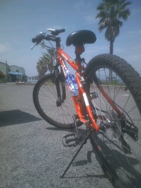

# GPS Tags

## Remote File with GPS

<table>
<tr style='display: flex; align-items: top;'>
<td>

|Attribute|Value|
|:---|---:|
|Image Direction|
M 352.40°
|
|Speed|12.45kt|
|Track|
M 62.90°
|
|Destination Bearing|
M 138.69°
|
|Datestamp|2018/03/31 (UTC)|
|Timestamp|02:22:14 (UTC)|
</td>
<td>

|Tag|Value|
|:---|---:|
|GPS_IFD_Pointer|366|
|GPSLatitudeRef|N|
|GPSLatitude|31/1 34/1 8083/1000|
|GPSLongitudeRef|E|
|GPSLongitude|35/1 30/1 5245/1000|
|GPSAltitudeRef|1|
|GPSAltitude|42200/100|
|GPSTimeStamp|2/1 22/1 14/1|
|GPSSpeedRef|N|
|GPSSpeed|22778/1829|
|GPSTrackRef|M|
|GPSTrack|157243/2500|
|GPSImgDirectionRef|M|
|GPSImgDirection|195581/555|
|GPSDestBearingRef|M|
|GPSDestBearing|83632/603|
|GPSDateStamp|2018:03:31|
</td>
</tr>
</table>

## Local File with GPS

<table>
<tr style='display: flex; align-items: top;'>
<td>

|Attribute|Value|
|:---|---:|
|Image Direction|
T 306.25°
|
|Speed|1.60mph|
|Track|
M 359.90°
|
|Datestamp|2023/09/18 (UTC)|
|Timestamp|03:43:32 (UTC)|
</td>
<td>

|Tag|Value|
|:---|---:|
|GPS_IFD_Pointer|908|
|GPSLatitudeRef|N|
|GPSLatitude|37/1 3/1 26187/1000|
|GPSLongitudeRef|E|
|GPSLongitude|140/1 53/1 32790/1000|
|GPSAltitudeRef|0|
|GPSAltitude|1300/100|
|GPSTimeStamp|3/1 43/1 32/1|
|GPSSpeedRef|M|
|GPSSpeed|16/10|
|GPSTrackRef|M|
|GPSTrack|224936/625|
|GPSImgDirectionRef|T|
|GPSImgDirection|191409/625|
|GPSDateStamp|2023:09:18|
</td>
</tr>
</table>

## No GPS tags

<table>
<tr style='display: flex; align-items: top;'>
<td>

</td>
<td>

No GPS data.

