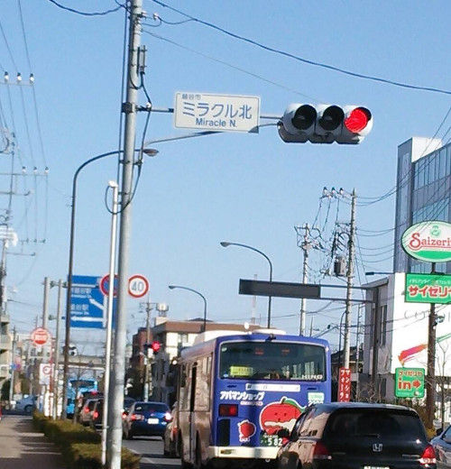

# Photo GPS: List

<table>
<tr><th>Image</th><th>GPS</th><th>Coordinate</th></tr>
<td></td><td>o</td><td>
<a href='https://www.google.com/maps/place/37%C2%B03%2734.6%22N+140%C2%B052%2756.4%22E/@37.0596047,140.8823289,17z/?authuser=0&entry=ttu'>37.05960472222222, 140.88232888888891</a> 
140°52'56.4"E, 37°3'34.6"N 
東経140度52分56.4秒, 北緯37度3分34.6秒 
</td></tr>
<td></td><td>o</td><td>
<a href='https://www.google.com/maps/place/35%C2%B052%2720.5%22N+139%C2%B047%270.8%22E/@35.8723586,139.7835639,17z/?authuser=0&entry=ttu'>35.87235861111111, 139.78356388888889</a> 
139°47'0.8"E, 35°52'20.5"N 
東経139度47分0.8秒, 北緯35度52分20.5秒 
</td></tr>
<td></td><td>o</td><td>
<a href='https://www.google.com/maps/place/36%C2%B056%273.8%22N+140%C2%B055%2713.6%22E/@36.9343917,140.9204425,17z/?authuser=0&entry=ttu'>36.93439166666666, 140.92044249999998</a> 
140°55'13.6"E, 36°56'3.8"N 
東経140度55分13.6秒, 北緯36度56分3.8秒 
</td></tr>
<td></td><td>o</td><td>
<a href='https://www.google.com/maps/place/37%C2%B01%2758.6%22N+140%C2%B054%274.4%22E/@37.0329453,140.9012353,17z/?authuser=0&entry=ttu'>37.03294527777778, 140.90123527777777</a> 
140°54'4.4"E, 37°1'58.6"N 
東経140度54分4.4秒, 北緯37度1分58.6秒 
</td></tr>
<td></td><td>o</td><td>
<a href='https://www.google.com/maps/place/38%C2%B015%2749.9%22N+140%C2%B052%2715.1%22E/@38.2638617,140.8708508,17z/?authuser=0&entry=ttu'>38.26386166666666, 140.87085083333335</a> 
140°52'15.1"E, 38°15'49.9"N 
東経140度52分15.1秒, 北緯38度15分49.9秒 
</td></tr>
<td></td><td>o</td><td>
<a href='https://www.google.com/maps/place/37%C2%B03%2726.2%22N+140%C2%B053%2732.8%22E/@37.0572742,140.8924417,17z/?authuser=0&entry=ttu'>37.05727416666667, 140.89244166666666</a> 
140°53'32.8"E, 37°3'26.2"N 
東経140度53分32.8秒, 北緯37度3分26.2秒 
</td></tr>
<td></td><td>x</td><td>
---
</td></tr>
</table>
